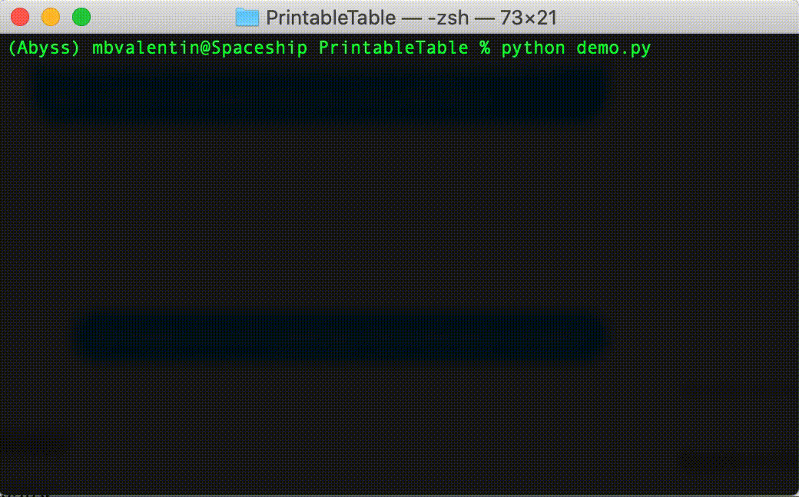

# DynamicTable
#### An easy and user-friendly way to display dynamic data in Python
author: Manu Blanco Valentin </br>
github: [manuelblancovalentin](http://github.com/manuelblancovalentin) </br>
version: v0.0.4


## What is this module intended for?

DynamicTable is a module designed to provide an easy way for Python3+ users to display dynamic data in a tabular way in the command line in an easy and compact way. 

Using the DynamicTable object is as easy as it comes. Simply initialize the header and update/append lines to the table as many times as desired. 

Even though DynamicTable is great for displaying static data, it might be more useful for displaying data that constantly changes inside a loop or a recursive activity. For instance, DynamicTable can be used inside a custom loop when training a model, to display the training process.

Take a look at an example (code provided below).  




## How to install?

To start using DynamicTable simply install it via pip using the following command:

```bash
pip install DynamicTable
```

Extra documentation about the module can be found in our pypi page:

https://pypi.org/project/DynamicTable/
 
## How to use DynamicTable?

There are basically four instructions to be considered when using DynamicTable:

* __Initialization__: DynamicTable must be initialized with a list of strings for the header and, optionally, a formatter for each one of the entries in header. Valid formatters are those accepted in common Python3+ string formatting ops ([see here](https://realpython.com/python-f-strings/)). Apart from these, an special format is accepted, denoted by ``$%`` which is used for displaying progress bars. 

* __Print header__: Once the object has been instantiated, the header can be printed using the instruction ``<DynamicTableObject>.print_header()``

* __Update line__: To update the values, simply pass a dictionary with a value (or list of values) for each entry in the header. Two flags are very useful when updating the values of the table: 
	* append (default = False): If true, the values introduced will be stored in a new row. If false, the last row will be updated. 
	* print (default = True): If true, the values will be printed into the table.

	``<DynamicTableObject>.update_line(values, append = <True/False>, print = <True/False>)``

* __Print bottom__: Print the bottom part of the table once the loop is exited.


Take a look at this demo snippet (which produces the result displayed in the GIF above):

```python
""" Import basic modules """
import time
import numpy as np
	
""" Import DynamicTable """
from DynamicTable import DynamicTable
	
""" Init table """
header = ['Epoch','Progress','loss_labels']
formatters = {'Epoch':'{:03d}', 'Progress':'%$', 'loss_labels':'{:.3f}'}
progress_table = DynamicTable(header, formatters)
	
""" Print header """
progress_table.print_header()
	
""" Loop thru iters """
for i in range(5):
    time.sleep(1)
    for b in range(100):
        """ Perform some action here
	
            ...
	
        """
        time.sleep(.01)
	
        """ Get updated values to be set into table """
        vals = {'Epoch': i, 'Progress': b/99, 'loss_labels': 100*np.random.randn()}
	
        """ Update and print line """
        progress_table.update_line(vals, append = b == 99, print = True)
	
""" As we exit the loop, print the bottom of the table """
progress_table.print_bottom()

```

## How to cite this work?

Please, if you found my work valuable and it was useful for you, consider citing it in any published work that used it to help me improve the visibility of my code and make it easier for other people to access it. 

If so, use the following bibtex entry in your paper:

```
@misc{MBValentin2020DynamicTable,
  author = {Valentin, Manuel Blanco},
  title = {Dynamic Table: An easy and user-friendly way to display dynamic data in Python},
  year = {2020},
  publisher = {GitHub},
  journal = {GitHub repository},
  howpublished = {\url{https://github.com/manuelblancovalentin/DynamicTable}}
}
```
